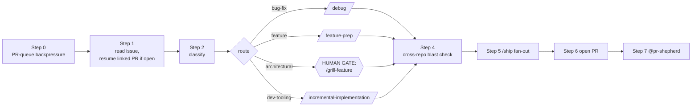

# From-issue — single command from GH issue to merge-ready PR



## Overview

The orchestrator. Composes the existing skills end-to-end so one invocation covers: classify → route → implement → test → ship → babysit. Does NOT replace the underlying skills — calls each in turn at the right phase, and respects the same human gates each skill already enforces.

The bias: trust the chain for mechanical work, stop and ask the human at the gates that need judgment. Default is interactive; `--auto` is opt-in and only fires for mechanical classes.

## When to use

- "Work issue #123" / "implement this issue" / "drive this to a PR"
- A teammate filed a bug and you want one command to triage + fix + ship
- A small feature is in the issue tracker and you want one command to start the standard pipeline
- Routine dev-tooling work (dep bump, lint fix, doc-only) where you want autonomy

**Skip** for:

- Open-ended exploration ("should we even build this?") — that's `/feature-prep` or `/grill-feature` alone
- Multi-issue programs ("ship this whole epic") — break into per-issue runs
- Issues that are actually questions or design discussions, not work — answer the question; don't open a PR
- Work that has no associated issue — use the underlying skills (`/feature-prep`, `/debug`, etc.) directly

## Inputs

```
/from-issue <issue-url-or-number> [repo] [--auto]
```

- `<issue-url-or-number>` — required. Either a full URL like `https://github.com/acme/api/issues/42` or just `42` if `[repo]` is given.
- `[repo]` — required when only a number is passed. `owner/repo`, or just `repo` — the default owner is `org.github_org` from `.aif/config.yml`; if that key is absent, fall back to the owner of the current repo's `origin` remote.
- `--auto` — opt-in. Only effective when classifier returns `bug-fix` or `dev-tooling` AND no spec-registry gate triggered AND no cross-service blast. Falls back to interactive on any escalation signal.

Aliases the model should also accept: issue labeled `auto-ok` implies `--auto` was passed.

### Notes intake (no issue yet)

When the input is unstructured — pasted meeting notes, a Slack thread, user feedback — instead of an issue reference, run an intake pass BEFORE the pipeline. The issue stays the artifact of record; this mode widens the funnel, it does not bypass it:

1. **Extract** each distinct actionable item from the notes (a bug, a feature ask, a tooling chore). Discard commentary and decisions-already-made; keep the evidence (quotes, repro details) attached to its item.
2. **Dedupe** against existing open issues (`gh issue list --search "<keywords>"` per item, in the repo the item points at). An item that matches an open issue becomes a comment on that issue, not a duplicate.
3. **File** the genuinely new items (`gh issue create`) — one issue per item, evidence in the body, never a grab-bag issue. Show the user the drafted issues before creating them.
4. **Continue**: hand the filed issue(s) to Step 1. Multiple items → ask which to drive now; the rest stay filed for later runs. `--auto` never combines with notes intake — extraction is a judgment step.

## Process

### Step 0 — Review-queue backpressure

Before starting new work, check your open-PR count against `org.max_open_prs` in `.aif/config.yml` (source `partials/forge.sh`, `aif_forge_pr_list --author "@me" --state open`). At or above the cap (no key → warn at 10+ but don't block): stop and surface the queue — landing an existing PR beats opening another. The user may override explicitly; `--auto` mode never overrides (it exits with the queue report instead).

### Step 1 — Read the issue

```bash
gh issue view <num> -R <owner/repo> \
  --json number,title,body,labels,assignees,comments,closedByPullRequestsReferences,state,milestone,author
```

If an open PR already references this issue (`closedByPullRequestsReferences`), STOP and resume that PR instead — do not open a parallel one. The field only carries number + URL, not the branch, so explicitly fetch the head ref before doing anything else:

```bash
. .aif/partials/forge.sh 2>/dev/null || . ~/.claude/skills/partials/forge.sh
aif_forge_pr_view <pr-number> -R <owner/repo> --json headRefName,headRepository
git -C <local-clone> fetch origin <headRefName>
git -C <local-clone> checkout <headRefName>
```

Then hand off to `@pr-shepherd` with the `<owner>/<repo>` slug + PR number per Step 7.

Read all comments. Extract: reproducer code, stack traces, error messages, file paths, service names, configuration snippets. These feed Step 3.

### Step 2 — Classify

Classify into one of:

| Class | Signals (label, body keywords) | Routing |
|---|---|---|
| `bug-fix` | label `bug`, keywords: "stack trace", "panic", "error: ...", "fails when", "regression", "no longer", "used to work" | → `/debug` first |
| `feature` | label `enhancement`, keywords: "support X", "we should add", "new endpoint", "expose", "ability to" | → `/feature-prep` first |
| `architectural` | label `arch` / `design`, keywords: "redesign", "rewrite", "new service", "new schema", "auth contract", "authorization policy", "multi-tenancy boundary", "event/span shape", "public API", touches ≥2 services in body | → `/grill-feature` first |
| `dev-tooling` | label `chore` / `tooling`, keywords: "dependency", "lint", "format", "CI", "hook", "skill", "settings.json", "GitHub Actions" | → straight to `/incremental-implementation` |
| `refactor` | label `refactor` / `tech-debt`, internal-only, no contract change | → `/feature-prep` (Step 2a will likely return `NO_TEST` / `EXTEND_EXISTING`) |

If two classes seem to apply, take the higher-stakes one. "Bug that requires schema change" = `architectural` (a schema change is a contract change), not `bug-fix`.

If classification is ambiguous, **STOP and ask the user** with a one-sentence summary of the signals you saw.

### Step 3 — Route through the right front-end

#### Path A — `bug-fix`

1. Invoke `/debug` discipline. Phase 1 is non-negotiable: build a fast deterministic feedback loop using the reproducer in the issue (or build one from scratch if the issue gave you a description but no repro).
2. Localize → root-cause (the three Whys) → fix → guard test → verify per `/debug`.
3. **Skip `/feature-prep` Step 1** (no spec change for a bug fix that restores existing-spec behavior). DO use `/feature-prep` Step 2 to decide where the guard test goes.

#### Path B — `feature`

1. Invoke `/feature-prep`. Get Step 1 outcome (`NO_UPDATE` / `EDIT_EXISTING` / `NEW_ENTRY` / `NEW_PRIMITIVE`). The spec-registry gates below only exist when `org.spec_registry` is configured in `.aif/config.yml` — when it's absent, Step 1 collapses to `NO_UPDATE`; note that and move on.
2. **HUMAN GATE on `NEW_ENTRY`**: STOP, present the draft entry, get user confirmation before opening the spec-only PR. Spec PR lands FIRST, separately. Then resume.
3. **HARD STOP on `NEW_PRIMITIVE`**: per `/feature-prep` rule, surface to user; do not draft one.
4. Get Step 2 outcome (test placement).
5. Invoke `/incremental-implementation` for the work.

#### Path C — `architectural`

1. **HUMAN GATE**: Invoke `/grill-feature`. The grilling is interactive by design — one question at a time, user-driven. Do not auto-answer. Capture decisions into a spec-registry entry draft, ADR draft, or assumptions block per `/grill-feature` Step 3.
2. Then proceed as Path B.

#### Path D — `dev-tooling`

1. Skip `/feature-prep` and `/grill-feature`. Go straight to `/incremental-implementation`.
2. The test is usually "CI passes" — no extra test needed unless changing a hook or script that has its own tests.

#### Path E — `refactor`

1. Same as Path B, but Step 2 will commonly return `NO_TEST` / `EXTEND_EXISTING`. Don't manufacture tests for behavior that didn't change.

### Step 4 — Cross-repo blast check

For Paths B and C (and any bug-fix that touched a shared contract), delegate to `@cross-repo-impact` before opening the PR. If it surfaces breaks in other repos:

- **In `--auto` mode**: STOP. Auto-mode does not silently change multiple repos. Report the punch list and ask.
- **In interactive mode**: review the list with the user, decide whether to bundle, sequence, or split.

### Step 5 — Run pre-merge fan-out

Invoke `/ship`. It will fan out:

- `@cross-repo-impact` (skip if already run in Step 4 — reuse the result)
- `@security-reviewer`
- `@migration-analyzer` (if SQL touched)
- `@cedar-policy-reviewer` (only if your org uses Cedar and policy files are in the diff)
- `@gemini-reviewer` is not run here (PR isn't open yet)

If `/ship` returns `no-go`, STOP. Surface the findings. Do not open the PR.

### Step 6 — Open the PR

- Branch name: `<prefix>/<short-slug>-<issue-number>` (e.g. `feat/` / `fix/` / `chore/`)
- Commit subject prefix: must match `org.commit_prefix_regex` from `.aif/config.yml` (default when absent: conventional commits — `feat|fix|docs|style|refactor|perf|test|build|ci|chore|revert`) — see `~/.claude/aif-references/commit-prefix-check.md`
- **Classification → prefix mapping**:
  - `bug-fix` → `fix:` + `fix/<slug>-<num>`
  - `feature` / `architectural` → `feat:` + `feat/<slug>-<num>`
  - `dev-tooling` → `chore:` + `chore/<slug>-<num>`
  - `refactor` → `refactor:` only if `org.commit_prefix_regex` allows it; otherwise `feat:` (if it enables new capability) OR `fix:` (if it fixes a latent bug). **Never emit a subject the CI regex rejects** — check the regex first; see `~/.claude/aif-references/commit-prefix-check.md`.
- PR body must include:
  - `Closes #<issue-number>`
  - Summary (1–3 bullets — what changed, not what was broken)
  - Test plan checklist
  - If a spec-registry `NEW_ENTRY` happened: link the spec PR
  - If `--auto` was used: a line saying "Drafted via /from-issue --auto" so reviewers know

Use `/git-workflow` for the actual commit/branch/PR mechanics.

### Step 7 — Hand off to @pr-shepherd (background)

Launch `@pr-shepherd` in the BACKGROUND with its documented inputs: the `<owner>/<repo>` slug and the PR number. (See `agents/pr-shepherd.md` — it operates on whatever branch the PR points at, fetches + checks out the head ref itself; do NOT pass the worktree path.) It will:

- Poll CI
- Fix mechanical failures (commit prefix, dependency-scan findings, formatter drift, lockfile drift) per the shepherd's own playbook — it MAY rewrite unpushed-or-own-branch history (`--amend`, reword, `push --force-with-lease`) for commit-format repairs; see `agents/pr-shepherd.md` for what it will and won't touch
- Delegate to `@gemini-reviewer` for review-bot comments (when your org has such a bot)
- Stop on non-mechanical failures and report

Do NOT block on shepherd. Return control to the user with the PR URL and a one-line status.

### Step 8 — Final status report

Output to the user:

```
/from-issue complete — PR opened, shepherd running.
  Classification: <class>
  Path taken: <A/B/C/D/E>
  Gates hit (still need you):
    - <gate>: <what's pending>
  PR: <url>
  Shepherd: running in background (will notify on green or stuck)
```

If a gate was hit and the user needs to act (e.g., approve spec PR, answer a grill question), make that the first line — not buried.

## --auto mode contract

`--auto` is honored ONLY when ALL of:

- Classification is `bug-fix` OR `dev-tooling`
- The work would not need a spec-registry change — i.e. `/feature-prep` Step 1 would return `NO_UPDATE` if run (vacuously true for the paths that skip Step 1, and automatic when no `org.spec_registry` is configured)
- `@cross-repo-impact` returns "single repo, no shared contract"
- No SQL migration in the diff
- No authorization policy or policy-schema file change (e.g. Cedar, if your org uses it)
- No change to tenant-isolation plumbing (the columns/claims listed in `tenancy.keys`, when configured)

If ANY check fails, auto-mode degrades silently to interactive. Tell the user which check tripped.

In `--auto` mode the model still STOPS for:

- `/ship` → no-go (security/migration/policy/cross-repo concern)
- `@pr-shepherd` → non-mechanical CI failure
- Human review comments on the PR (not the review bot)

## Human gates that always remain manual

1. **`/grill-feature` Q&A** — interactive by design; auto-answering defeats the skill.
2. **`NEW_ENTRY` in the spec registry** (`org.spec_registry`) — the spec is the contract; never draft autonomously. (Moot when no registry is configured.)
3. **`NEW_PRIMITIVE`** — explicitly forbidden by `/feature-prep`.
4. **Human review comments on the PR** (not the review bot). Reviewer wants judgment, not mechanical edits.
5. **Final `gh pr merge`** — self-merging is a foot-gun even with green CI.

## Cross-cutting gotchas

- **Multi-tenancy bugs**: if the bug touches the flows around your tenant-isolation keys (`tenancy.keys` in `.aif/config.yml`), Step 2 classification stays `bug-fix` but Step 4 cross-repo check is mandatory. Path A bug-fix mode still requires the tenant-isolation assertion in the guard test (per `/debug` Phase 5). Skip this rule only when `tenancy.keys` is not configured.
- **Issue mentions an authorization policy or policy schema**: escalate to `architectural` classification even if the user filed it as a bug. Policy changes flow through the policy reviewer in `/ship` (e.g. `@cedar-policy-reviewer` for Cedar shops).
- **Issue body has a reproducer code/curl block**: USE IT verbatim as Phase 1 of `/debug`. Don't re-derive one.
- **Issue is on a docs-only repo** (e.g. your architecture-docs repo): skip `/ship` entirely. There's no code, no migrations, no policies to review; the verification checklist in this skill already lists "bypassed for docs-only" as a valid outcome. Path D.
- **Issue is cross-repo from day 1** (body explicitly lists three or more repos): force `architectural` classification; `--auto` degrades immediately.
- **Issue references a spec-registry entry ID**: confirm with the user before classifying. Spec-tied issues often need a spec-level decision the issue body doesn't capture. (Only applies when `org.spec_registry` is configured.)
- **Worktree hygiene**: if your local clone of the repo has an in-progress branch / unresolved merge, use a fresh worktree off `origin/main`. Don't push onto a dirty checkout.

## Rationalizations (and rebuttals)

| You'll be tempted to think… | Why it's wrong |
|---|---|
| "I'll auto-answer the grill questions to keep momentum" | The grill is the user's design review of their own work. Auto-answering defeats it. Stop and ask. |
| "The issue mentions an authz policy but it's a one-line fix" | Policy changes go through the policy reviewer even for one-liners. Don't shortcut. |
| "I'll skip `@cross-repo-impact` — it's a small change" | Small changes break things at distance. The whole point of the agent is you trust it to check. |
| "`--auto` was passed so the classifier outcome is binding" | `--auto` is a permission, not a command. If the classifier picks `architectural`, auto degrades. Don't override. |
| "The reviewer's comment is mechanical, I'll fix it without asking" | If a human reviewer (not the bot) posted it, the assumption is they want acknowledgment + judgment. Reply, don't silently mutate. |
| "I'll merge once CI is green and shepherd is done" | Final merge is human. Always. |
| "I'll bundle the spec PR with the implementation PR to save time" | Spec PRs are PURE. Bundling violates `/feature-prep` and gets the entry stuck at the wrong status. |

## Red flags

- You're 3 minutes in and have already opened a PR for an `architectural` issue without invoking `/grill-feature`. Stop, close the PR, restart.
- Auto-mode is processing an issue with a label like `arch` or `breaking-change`. The classifier should have degraded; investigate.
- `/ship` returned `no-go` and you opened the PR anyway. That defeats the gate.
- You're addressing a human reviewer's comment by silently pushing a fix. They asked for engagement, not edits.
- The issue had no reproducer and you skipped `/debug` Phase 1. Build the loop.
- You're invoking `/from-issue` on an issue that's actually a discussion ("should we...") not work. Answer in the comments; don't open a PR.

## Verification

Done when:

- [ ] Issue classified with reasoning
- [ ] Right front-end skill was invoked (`/debug` / `/feature-prep` / `/grill-feature` / direct-to-implementation)
- [ ] Human gates were respected (no autonomous `NEW_ENTRY`, no auto-answered grill, no skipped review comments)
- [ ] `@cross-repo-impact` ran or was explicitly skipped with reason
- [ ] `/ship` ran and returned `go` (or was bypassed for docs-only)
- [ ] PR is open with `Closes #<num>` and the right commit prefix
- [ ] `@pr-shepherd` is running in background
- [ ] Final status output lists classification + path + gates + PR URL

## Anti-patterns

- Auto-answering grill questions to "save time"
- Drafting `NEW_ENTRY` or `NEW_PRIMITIVE` without user confirmation
- Opening a PR before `/ship` returns go (especially `@security-reviewer`)
- Bundling the spec PR with the implementation PR
- Self-merging on green CI
- Silently fixing human reviewer comments instead of replying first
- Running `--auto` on an architectural issue because the user typed `--auto`
- Re-opening a PR when one is already linked to the issue
- Pushing to a dirty worktree / in-progress merge instead of branching from `origin/main`
- Skipping `/debug` Phase 1 because "the bug is obvious"

## Example end-to-end runs

### Example 1 — small bug fix, `--auto` honored

```
User: /from-issue 487 api --auto

Step 1: Read issue #487 — "api returns 500 when a rule has an empty action list"
Step 2: Classify → bug-fix (reproducer block in body)
Step 3 Path A:
  /debug Phase 1: extract repro → curl against local :8080 with empty-action rule
  Phase 2: localize → internal/rules/evaluator.go:142
  Phase 3: three Whys answered
  Phase 4: minimal fix
  Phase 5: guard test in internal/rules/evaluator_test.go (repo-local per /feature-prep Step 2)
  Phase 6: make test + lint + build pass
Step 4: @cross-repo-impact → "single repo, no shared contract" — auto OK
Step 5: /ship → @security-reviewer go, no SQL, no policy change → go
Step 6: PR opened — fix: handle empty action list in rule evaluator (Closes #487)
Step 7: @pr-shepherd launched in background

/from-issue complete — PR opened, shepherd running.
  Classification: bug-fix
  Path: A (auto)
  Gates hit (still need you): none
  PR: https://github.com/acme/api/pull/2241
  Shepherd: running in background
```

### Example 2 — architectural feature, gates fire

```
User: /from-issue https://github.com/acme/billing-service/issues/602

Step 1: Read issue — "Support delegated service tokens for sub-org boundaries"
Step 2: Classify → architectural (touches auth contract + multi-tenancy boundary + new domain concept "delegated token")
Step 3 Path C:
  /grill-feature Step 0 gates → 3 of 5 fire (cross-service, contract, new domain concept)
  HUMAN GATE: 14 grill questions, one at a time. Captured: 1 spec-registry NEW_ENTRY draft, 1 ADR draft, 4 assumptions
  HUMAN GATE: spec-registry NEW_ENTRY → STOP. Drafted entry shown. User confirms.
  Spec-only PR opened against the registry's repo for the new entry.

[Pause for spec PR to merge — user resumes /from-issue afterward.]

  Path C continues:
  /feature-prep Step 2 → REGRESSION + REPO_LOCAL
  /incremental-implementation across api → billing-service → web
Step 4: @cross-repo-impact → confirms the three repos already identified during /grill-feature; punch list matches.
Step 5: /ship → all green
Step 6: PRs opened across the three repos in the right order per /incremental-implementation
Step 7: @pr-shepherd launched on each

/from-issue complete — 3 PRs opened, shepherd running.
  Classification: architectural
  Path: C (interactive)
  Gates hit: spec entry (resolved), grill (14 Q answered)
  PRs:
    - https://.../api/pull/318
    - https://.../billing-service/pull/1052
    - https://.../web/pull/2811
  Shepherd: running on all three
```

## See also

- `/feature-prep` — spec-registry decision + test placement
- `/grill-feature` — adversarial design review (architectural only)
- `/debug` — local repro + root-cause discipline
- `/incremental-implementation` — thin vertical slices across repos
- `/ship` — pre-merge multi-reviewer fan-out
- `/git-workflow` — commit prefixes, branch + PR mechanics
- `@pr-shepherd` — auto-fix mechanical CI + delegate review-bot comments
- `@cross-repo-impact` — blast-radius enumeration
- `~/.claude/aif-references/commit-prefix-check.md` — what subject lines pass CI
