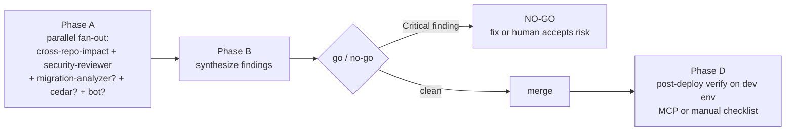

# Ship — pre-merge fan-out + post-deploy verification

## Overview

`/ship` is the pre-merge gate. It runs the specialist subagents in parallel, merges their findings into a single decision, and after merge verifies the deploy on your shared dev environment (`environments.dev` in `.aif/config.yml`) — via MCP tools when `mcp.namespace` is configured, otherwise via a manual verification checklist.

This is the orchestration layer over the existing subagents. It does not replace them; it sequences them.



## When to use

- Staging a non-trivial PR (>2 files OR touches auth/data/migrations/config)
- After pushing to a PR you want green without babysitting
- Before merging anything to `main` that auto-deploys to a shared environment

**Skip the fan-out** only if the change touches ≤2 files, ≤50 lines, AND does not touch auth, data access, migrations, or config/env. Otherwise default to fan-out — `/ship` is designed for production-bound changes and the blast radius of "small but in auth code" is not small.

## Phases

### Phase 0 — capture intent (do this first)

Before fanning out, write a short **intent block**: _what the user set out to accomplish_, in their terms. Not a description of the diff — the goal, the decisions and tradeoffs made along the way, constraints ruled in or out, and anything explicitly requested that would look surprising in the diff. You know it from the conversation; a few sentences to a short paragraph is right.

You pass this block **verbatim at the top of every subagent prompt** in Phase A. Its job: let each reviewer tell a _deliberate decision_ apart from a _mistake_. A reviewer reading only the diff flags things the user chose on purpose — `security-reviewer` calls a widened scope a leak, `gemini-reviewer` re-litigates a tradeoff already settled, `cross-repo-impact` chases a contract you intentionally left for a follow-up PR. The intent block is what a reviewer who had read the whole conversation would already know.

```
INTENT (treat the deliberate choices below as intended, not bugs):
- Goal: <the objective, in the user's terms>
- Decisions/tradeoffs: <what was chosen and why; what was ruled out>
- Constraints: <anything that must hold; anything explicitly requested>
- Surprising-but-intended: <anything in the diff that looks wrong but is deliberate>
```

### Phase A — parallel fan-out

Spawn the relevant subagents **concurrently** in a single assistant turn. Sequential calls defeat the purpose. **Prefix every subagent prompt with the Phase 0 intent block, then the agent's specific task** — so each reviewer evaluates the diff against what the change was meant to do, not against the diff alone.

| Subagent                | Always or conditional?                                          | What it does                                                                                              |
| ----------------------- | ---------------------------------------------------------------- | ---------------------------------------------------------------------------------------------------------- |
| `cross-repo-impact`     | always                                                           | Punch list of files in other repos that need to change (client apps, SDKs, ingestion pipelines, etc.)      |
| `security-reviewer`     | always                                                           | Auth, multi-tenancy (per `tenancy.keys`), JWT, secret exposure, SQL injection audit                         |
| `migration-analyzer`    | only if any `*.sql`, `migrations/*`, or migration code touched   | Locking, backfill, rollback safety                                                                          |
| `cedar-policy-reviewer` | only if your org uses Cedar AND any `*.cedar` or Cedar schema files touched | Schema conformance + scoping conventions                                                        |
| `gemini-reviewer`       | only if a GitHub PR is already open AND a review bot (e.g. Gemini) comments on your org's PRs | Triages bot comments — applies the good ones, rejects bad ones with reasons  |

Each subagent runs in its own context window and returns a focused report.

**Subagents cannot spawn other subagents.** Don't let one delegate to another. Synthesis happens in this main session.

### Phase B — synthesize in main context

Once reports return, the main agent merges:

1. **Code quality** — aggregate Critical/Important from `security-reviewer` and any policy-reviewer findings. Resolve duplicates.
2. **Security** — promote any Critical/High `security-reviewer` finding to a launch blocker.
3. **Migration safety** — if `migration-analyzer` ran, treat any locking/backfill/rollback red flag as a blocker.
4. **Cross-repo follow-ups** — list every other repo that needs a follow-up PR. Decide: bundle in this PR or schedule a follow-up.
5. **Bot review comments** — confirm the applied/rejected list from `gemini-reviewer` (if it ran).

### Phase C — decision and rollback

Produce one output:

```markdown
## Ship Decision: GO | NO-GO

### Blockers (must fix before merge)

- [Source agent: file:line — finding]

### Recommended fixes (should fix before merge)

- [Source agent: finding]

### Cross-repo follow-ups

- [Repo: file — what needs to change; bundle now / schedule later]

### Acknowledged risks (merging anyway)

- [Risk + mitigation]

### Rollback plan

- Trigger conditions: <error-rate spike / specific signal on the shared dev environment>
- Rollback procedure: <revert PR + redeploy / db rollback if migration / etc.>
- Recovery time objective: <minutes>

### Specialist reports (full)

- [cross-repo-impact]
- [security-reviewer]
- [migration-analyzer]
- [cedar-policy-reviewer]
- [gemini-reviewer]
```

If any specialist returned a Critical finding, default verdict is **NO-GO** unless the user explicitly accepts the risk.

### Phase D — post-merge verification on the shared dev environment

After merge, if your pipeline auto-deploys to the shared dev environment (`environments.dev.name`), wait ~3–5 minutes for the rollout, then verify.

**With MCP configured** (`mcp.namespace` set): use the `mcp__<namespace>__*` tools (see `~/.claude/aif-references/mcp-tools-cheatsheet.md`). Typical sequence — adapt to what your server actually exposes:

```
1. mcp__<namespace>__<pods tool>        → new image SHA running, no CrashLoopBackOff
2. mcp__<namespace>__<pod-logs tool>    → no boot errors, no panics, no DB migration failures
3. mcp__<namespace>__<events tool>      → no ImagePullBackOff, no OOMKilled
4. <observability tool, per environments.dev.observability> → error rate and p99 latency vs the prior hour
5. <service API tool>                   → if a policy/config surface was touched, confirm the change is live
6. <db schema tool>                     → if a migration ran, schema matches expectation
```

**Without MCP** (no `mcp.namespace`): do NOT fabricate live state. Walk a manual checklist using whatever access exists — `kubectl` if available, your cloud console, and the dashboards listed under `environments.dev.observability`:

- [ ] The new build/image is what's actually running (e.g. `kubectl get pods -o wide`, deploy dashboard)
- [ ] Startup logs are clean — no panics, no failed migrations
- [ ] No restart loops or OOM events since the rollout
- [ ] Error rate and latency vs the prior hour on your dashboards (record the concrete numbers)
- [ ] If a policy/config surface was touched: confirm the change is live via the service's API
- [ ] If a migration ran: the schema matches expectation

If `environments.dev` isn't configured at all, say so and hand the user this checklist to run against whichever environment receives the deploy.

If any check is red, drive the rollback: revert the PR, redeploy, and document the cause. The `pr-shepherd` agent handles mechanical CI re-runs after revert.

## Rationalizations (and rebuttals)

| You'll be tempted to think…                                     | Why it's wrong                                                                                                                                            |
| --------------------------------------------------------------- | ---------------------------------------------------------------------------------------------------------------------------------------------------------- |
| "It's a small diff, skip the fan-out"                           | Auth bugs are small diffs. Migration bugs are small diffs. The size threshold is loose because diff size isn't the right proxy for blast radius.          |
| "I'll skip `cross-repo-impact` because I only touched one repo" | The whole reason to run it is to find the other repos you didn't touch but should have.                                                                   |
| "I'll run the agents sequentially to keep my context clean"     | Sequential defeats the parallel design — they don't share state. Single turn, multiple tool calls.                                                        |
| "The bot already reviewed; I'll skip `gemini-reviewer`"         | The agent triages: applies the good comments, rejects the bad ones with reasons. Without it you'll either miss good ones or argue with bad ones manually. |
| "I'll verify the dev deploy later"                              | If auto-deploy is on and the rollout breaks, every other developer using the shared environment is blocked. Verify within 5 minutes of merge.             |
| "Rollback plan is overkill for this PR"                         | Mandatory before any GO decision. If you can't articulate a rollback, you don't understand the change.                                                    |
| "The diff speaks for itself, skip the intent block"             | It doesn't say what you _chose_. Without intent, `security-reviewer` flags the scope you widened on purpose and `gemini-reviewer` re-opens a settled tradeoff — you burn the review budget arguing with deliberate decisions. |

## Red flags

- Fanned out without the Phase 0 intent block. Reviewers will re-litigate deliberate decisions as bugs; add it and re-run.
- Any specialist returned Critical and the user hasn't explicitly accepted it. Do not GO.
- Migration touched but `migration-analyzer` not invoked. Add it.
- Authorization policy/schema touched but the policy reviewer (e.g. `cedar-policy-reviewer`) not invoked. Add it.
- Post-merge: a pod is stuck in CrashLoopBackOff and you haven't reverted. Revert first; debug second.
- You skipped Phase D because "the build was green." CI green is necessary, not sufficient — error rate on the shared dev environment is the real signal.
- No MCP configured and you reported live-looking pod/error-rate numbers anyway. Never fabricate live state; run the manual checklist or say what you couldn't check.

## Verification

The skill is done when:

- [ ] All applicable subagents fanned out in a single turn
- [ ] All reports merged into one Ship Decision document
- [ ] Rollback plan written before any GO
- [ ] If GO: post-merge checks all green within 5 min of rollout (MCP when configured, manual checklist otherwise)
- [ ] If NO-GO: blockers logged with file:line; user notified

## When the change is too small for full /ship

The threshold for skipping is strict: ≤2 files AND ≤50 lines AND does not touch auth, data access, migrations, or config/env. If all four are true, a single `security-reviewer` pass + a post-merge error-rate check (via `environments.dev.observability`) is enough. Document why you skipped the fan-out in the PR description.

## Anti-patterns

- Sequential subagent calls (defeats parallel)
- Letting a subagent spawn another subagent (forbidden by Claude Code's model)
- Synthesizing from the head — read each report, merge in this session
- GO with a Critical finding outstanding
- Skipping Phase D verification
- Verifying via "the dashboard looked fine" rather than concrete deltas (MCP queries or explicit dashboard numbers)
- Fabricating post-deploy state when no MCP server or cluster access exists
